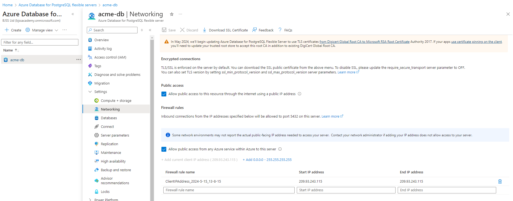
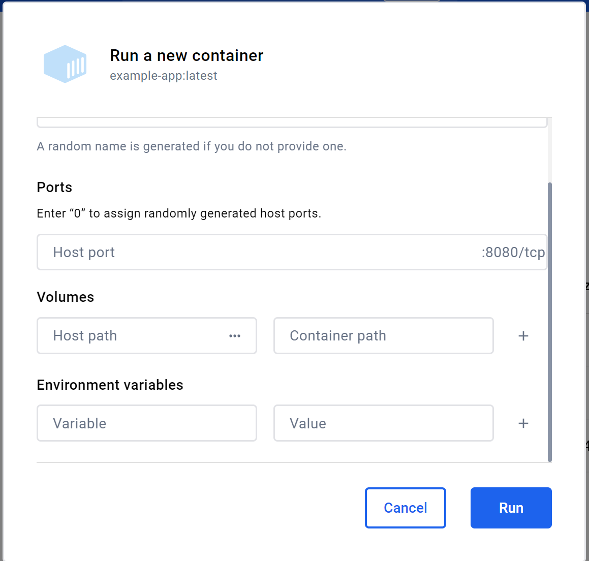
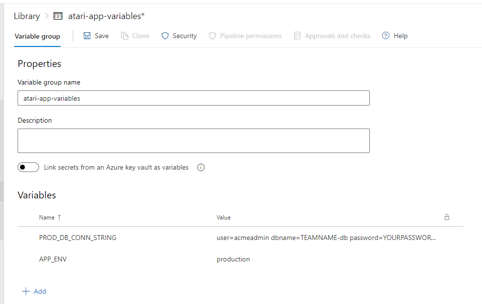
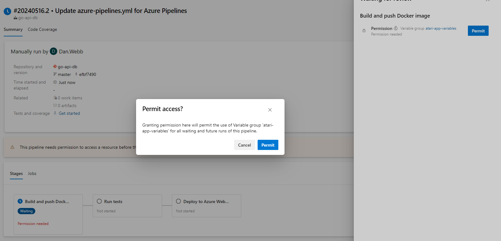
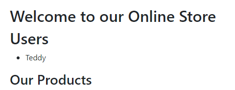

# Steel Thread

A "steel thread" refers to a *minimal yet functional* end-to-end implementation of a system or application that cuts through all layers of an architecture. That is, the front end connects to the api/business logic layer, to the database, and can return information through all of the layers.
 
It represents a basic but complete scenario that demonstrates how the core components of the system interact to achieve a specific functionality.

Think of it this way - if we have some information in a database (let's say products) then a minimal but functional implementation would be a user loading the homepage, which calls the API, which in turn gets the data and returns it, and the UI displays that data in some fashion.

## Why is this important?

Well, a common problem is that work split up by architectural layers rather than by functionality. In our example we might have one piece of functionality (display the products on the home page) which would be split into three separate stories, or work items:

1. Design the Product home page
2. Implement the business logic and API to call products
3. Create the products table in the database

Now, what happens when three separate teams develop those independently of one another? As you might have guessed we end up with some integration challenges.

- One team may finish well after the others due to other work, delaying the release of *value* to the customer
- The teams have not communicated, resulting in misalignment (wrong fields in table, different names, JSON format, etc) which means the product doesn't work *even though each team has done their own job "right"*
- Hidden bugs because of late integration - we can't test all the things together until everything is integrated

> "If we just had 5 more minutes at the end, we would have had it working."
>
> - *Literally everybody who has worked this way*

---

## The value of cross-functional teams

*Cross-functional teams* consist of members with different expertise working together on the entire project. Each team has developers, testers, UI/UX designers, and database specialists collaborating closely. 

First, this improve communication and collaboration. When people from different capabilities work together, they can share insights and spot potential issues early. For example, a database specialist can inform the UI designer about data constraints that might affect interface design. This early interaction helps prevent integration problems and misunderstandings. Awesome.

Secondly, cross-functional teams enhance *problem-solving and innovation*, by bringing together different perspectives that often leads to creative solutions that might not emerge in a siloed environment. A developer might suggest a feature that a tester improves upon, or a designer might propose an interface change that makes coding easier. 

Most importantly though, this approach allows for *quicker feedback* and *iteration*. In a cross-functional team, end-to-end functionality can be developed and tested incrementally, meaning that the team can rapidly build and evaluate small, functional segments of the application, gathering user feedback and *making adjustments continuously*. 

## Starting Out

Firstly, we currently connect to our database locally. This is great when we are developing locally, but somewhat problematic if we want people to actually use our app online.

So we need a remote Postgres database.

> We've created an Azure Postgres flexible server (`acme-db`) and a database for each team in the format `teamname-db`, where teamname is one of `atari`, `commodore`, `sinclair`, `sega`, `nintendo`
>
> If you are not on the BJSS course, check the Azure guide [here](https://learn.microsoft.com/en-us/azure/postgresql/flexible-server/quickstart-create-server-portal).

### Connect to our remote DB

> If you don't have the code from previous tasks, you can use that in the [code-postgres](/code-postgres/) folder.

You'll need to update your connection string in `main.go`:

```go
//connectionString := "user=postgres dbname=acme password=YOURPASSWORD host=localhost sslmode=disable host=host.docker.internal"
connectionString := "user=acmeadmin dbname=TEAMNAME-db password=PASSWORD host=acme-db.postgres.database.azure.com port=5432 sslmode=require"
```

> Remember to replace TEAMNAME and PASSWORD with the relevant details.

:exclamation: The Postgres server doesn't allow any old connection by default. You can either allow all public access (not recommended) or add your current IP address to the allow list. Click on the lin `+ Add current client IP address` to add your IP address to the allow list if it's not there.




When you run your code now, it will connect to the remote database and run any migrations you have.

### Migrations - Dockerfile

To enable migrations to run from our image, we have to copy the `migrations` folder in our Dockerfile. Update your Dockerfile to do so:

```docker
FROM golang:1.22.3-alpine3.19 AS build
WORKDIR /app
COPY . .
COPY go.mod ./
RUN go mod download && go mod verify
RUN go build -o main .
s
WORKDIR /app
COPY migrations /app/migrations

# Final stage
FROM scratch
WORKDIR /app
COPY --from=build /app/main .
COPY --from=build /app/migrations /app/migrations
EXPOSE 8080
CMD ["./main"]
```

## Environment Variables

Okay, so that's all good. But if we not want to connect to our local DB for development, we've got to change the code - and we've got to remember to change the code before we push it to prod, otherwise it won't work.

In Go, you can manage different connection strings based on the environment (development, testing, production, etc.) by using *environment variables*. This allows us to change the configuration without modifying the code.

> This is also good security practice, as we will no longer have passwords or usernames in our code or repository!

---

### Unix-like Systems (Linux, macOS)
#### Temporary Session Variables

```sh
export DEV_DB_CONN_STRING="user:password@/dev_db"
export TEST_DB_CONN_STRING="user:password@/test_db"
export PROD_DB_CONN_STRING="user:password@/prod_db"
export APP_ENV="development"
```

These variables will be available only for the *current terminal session*. They will be lost when you close the terminal.

#### Persistent Environment Variables
To make environment variables persistent across sessions, you typically add them to your shell's configuration file (e.g., `.bashrc`, `.bash_profile`, `.zshrc`).

##### Bash (~/.bashrc or ~/.bash_profile):

```sh
export DEV_DB_CONN_STRING="user:password@/dev_db"
export TEST_DB_CONN_STRING="user:password@/test_db"
export PROD_DB_CONN_STRING="user:password@/prod_db"
export APP_ENV="development"
```

##### Zsh (~/.zshrc):

```sh
export DEV_DB_CONN_STRING="user:password@/dev_db"
export TEST_DB_CONN_STRING="user:password@/test_db"
export PROD_DB_CONN_STRING="user:password@/prod_db"
export APP_ENV="development"
```

After adding the variables, you need to source the file to apply the changes.

```sh
source ~/.bashrc  # or ~/.bash_profile or ~/.zshrc
```

### Windows
#### Temporary Session Variables

##### Command Prompt

```cmd
set DEV_DB_CONN_STRING=user:password@/dev_db
set TEST_DB_CONN_STRING=user:password@/test_db
set PROD_DB_CONN_STRING=user:password@/prod_db
set APP_ENV=development
```

##### PowerShell

```powershell
$env:DEV_DB_CONN_STRING = "user:password@/dev_db"
$env:TEST_DB_CONN_STRING = "user:password@/test_db"
$env:PROD_DB_CONN_STRING = "user:password@/prod_db"
$env:APP_ENV = "development"
```

These variables will be available only for the current Command Prompt or PowerShell session.

#### Persistent Environment Variables
To set environment variables permanently using PowerShell, you can use the `setx` command. Note that `setx` writes to the registry and requires reopening the terminal to reflect changes.

```powershell
setx DEV_DB_CONN_STRING "user:password@/dev_db"
setx TEST_DB_CONN_STRING "user:password@/test_db"
setx PROD_DB_CONN_STRING "user:password@/prod_db"
setx APP_ENV "development"
```
---

## Using our environment variables

I'm on Windows, so I'm going to set my environment variables using PowerShell.

```powershell
setx DEV_DB_CONN_STRING "user=postgres dbname=acme password=YOURPASSWORD host=localhost sslmode=disable"
setx PROD_DB_CONN_STRING "user=acmeadmin dbname=TEAMNAME-db password=YOURPASSWORD host=acme-db.postgres.database.azure.com port=5432 sslmode=require"
setx APP_ENV "development"
```

> :exclamation: WINDOWS :exclamation: YOU WILL NEED TO RESTART ANY VS CODE INSTANCES BEFORE YOU WILL BE ABLE TO READ THE ENVIRONMENT VARIABLES!

Now we need to update our Go code. Import the `os` package, and add the following function to `main.go`:

```go
func getConnectionString() (string, error) {
    env := os.Getenv("APP_ENV")
    var connString string

    switch env {
    case "development":
        connString = os.Getenv("DEV_DB_CONN_STRING")
    case "production":
        connString = os.Getenv("PROD_DB_CONN_STRING")
    default:
        return connString, errors.New("set APP_ENV, DEV_DB_CONN_STRING, and PROD_DB_CONN_STRING")
    }
    return connString, nil
}
```
This function will check that we have the environment variables set, and if not error.

Now we need to update our code in the main function, so we can get the connection string:


```go
connectionString, connStrErr := getConnectionString()
if connStrErr != nil {
    fmt.Println(connStrErr.Error())
    return
}
```

Now you can save you file and run it, and it will connect to your local database!

---

## Dockerfile ENV variables

Because we're creating a docker image, we would also update the environment variables inside that image...

```docker
# Set environment variables
ENV DEV_DB_CONN_STRING="user:password@/dev_db"
ENV PROD_DB_CONN_STRING="user:password@/prod_db"
ENV APP_ENV="development"
```

:exclamation: But that would mean we still have passwords in our checked in files. Hmmm.

Well, we can get over that locally by running the dockerfile like so:

```bash
docker run -e DEV_DB_CONN_STRING="user:password@/dev_db" -e TEST_DB_CONN_STRING="user:password@/test_db" -e PROD_DB_CONN_STRING="user:password@/prod_db" -e APP_ENV="development" example-app:latest
```

Which is a bit of a pain, but since we don't need the image locally we can work without the container. However, we can set env cars using Docker Desktop:



## Pipeline Variables

Of course, that doesn't help us on our production instance. We're going to need to make some changes so that we can store our env vars somehow and pass them to our dockerfile as part of our pipeline.

1. Go to your Azure DevOps project.
2. Navigate to Pipelines > Library.
3. Create a new Variable Group (eg `atari-app-variables`).
4. Add your secrets (PROD_DB_CONN_STRING, APP_ENV) 



### Update `azure-pipelines.yml`

```yaml
variables:
- group: atari-app-variables
- name: dockerRegistryServiceConnection 
  value: 'Docker ACR'
- name:  imageRepository
  value: 'TEAM/FIRST-LAST-example-app'
- name: containerRegistry
  value: 'YOURACR.azurecr.io'
- name: dockerfilePath
  value: '$(Build.SourcesDirectory)/Dockerfile'
- name: tag
  value: '$(Build.BuildId)'
- name: azureSubscription
  value: 'your-service-connector'
- name: appName
  value: 'acr-FIRST-LAST'
```

Update the Build stage to add the `env` step:

```yaml
- stage: Build
  displayName: 'Build and push Docker image'
  jobs:
  - job: Build
    displayName: 'Build'
    steps:
    - task: Docker@2
      inputs:
        command: 'buildAndPush'
        repository: $(imageRepository)
        dockerfile: $(dockerfilePath)
        containerRegistry: $(dockerRegistryServiceConnection)
        tags: |
          $(tag)
      env:
        PROD_DB_CONN_STRING: $(PROD_DB_CONN_STRING)
        APP_ENV: $(APP_ENV)
```

Update the Deploy stage to add the `env` step:

```yaml
- stage: Deploy
  displayName: 'Deploy to Azure Web App'
  dependsOn: Test
  jobs:
  - job: Deploy
    displayName: 'Deploy Azure Web App'
    steps:
    - task: AzureWebAppContainer@1
      displayName: 'Azure Web App on Container Deploy'
      inputs:
        azureSubscription: $(azureSubscription)
        appName: $(appName)
        containers: $(containerRegistry)/$(imageRepository):$(tag)
      env:
        PROD_DB_CONN_STRING: $(PROD_DB_CONN_STRING)
        APP_ENV: $(APP_ENV)
```

The first time you run this new pipeline it may require permission:



---

## Connect the UI

Now we need to deploy our front end code. We're going to use the code from the [React Basics]() tutorial, which you can find in the [code-frontend](/code-frontend/react-code/my-react-app/) folder.

Because we are *steel threading* we just want to prove the connection works between all the layers. To this end we'll just call the api endpoint `/api/users` and display the result.

Update your `Home.jsx` file (new code is in the `{/* NEW CODE STARTS */}` and `{/* NEW CODE ENDS */}` blocks):

```jsx
import { useState, useEffect } from 'react';
import ProductList from '../components/ProductList';

const Home = () => {
  const [products, setProducts] = useState([]);

  {/* NEW CODE STARTS */}
  const [users, setUsers] = useState([]);
  {/* NEW CODE ENDS */}

  useEffect(() => {

      const initialProducts = [
        { id: 1, name: 'Product 1', price: 10, stock_count: 5 },
        { id: 2, name: 'Product 2', price: 20, stock_count: 5 },
        { id: 3, name: 'Product 3', price: 30, stock_count: 0 },
        { id: 4, name: 'Product 4', price: 40, stock_count: 5 },
        { id: 5, name: 'Product 5', price: 50, stock_count: 5 },
      ];
    setProducts(initialProducts);
    
    {/* NEW CODE STARTS */}
    const fetchData = async () => {
      try {
        // Fetch data from the API endpoint
        const response = await fetch('https://acr-FIRST-LAST.azurewebsites.net/api/users');
        
        if (!response.ok) {
          throw new Error('Failed to fetch data');
        }
        
        const data = await response.json();

        setUsers(data);
      } catch (error) {
        console.error('Error fetching data:', error);
      }
    };

    fetchData();
    {/* NEW CODE ENDS */}

  }, []);

  return (
    <>
      <h2>Welcome to our Online Store</h2>

      {/* NEW CODE STARTS */}
      <h2>Users</h2>
      <ul>
        {users.map(user => (
          <li key={user.id}>
            {user.name}
          </li>
        ))}
      </ul>
      {/* NEW CODE ENDS */}

      {/* Render the ProductList component and pass products as props */}
      <ProductList products={products} />
    </>
  );
};

export default Home;
```

> :exclamation: Remember to change `acr-FIRST-LAST.azurewebsites.net` to your deployed web app URL!

If you haven't yet added any users, open ThunderClient and change your Post endpoint to point at the remote API and post a new user in.

Now when you run your app locally, you will see the users returned



## Tasks

Start by running locally. 

### Task 1

1. Create the products table if you have not already via a migration. It will need to have the columns `id`, `name`, `price`, and `stock_count`.
2. Create a struct for a product, this the json and db attributes, like the `user.go` model.
3. In `postgres.go`, write the function `GetProducts()` to execute the SQL.
4. Create a new service `products-service.go` that calls the db layer for products.
5. Create a new api layer, `products-api.go` to get all the products.
6. Add a handler for the route `api/products` to handle GEt requests.
7. Check it all works together!
8. Deploy the new backend and ensure your frontend still works.

### Task 2

We're going to have problems switching our front end code to either user `localhost` or our remote URL. Refactor the code so that it uses environment variables, like we have done with our backend code.

## Task 3

Deploy your front-end code as an Azure static web app - https://vitejs.dev/guide/static-deploy.html#azure-static-web-apps

## Task 4

Create a pipeline to deploy your app, rather than from VS Code.

---

## BJSS Course - React/Redux

You will need to create a new service layer. Create a folder called `apiService` and inside that a file called `index.js`:

```js
export const getTodaysDeals = async () => {
  try {
    const response = await fetch('https://example.com/api/todays-deals');
    if (!response.ok) {
      throw new Error('Failed to fetch today\'s deals');
    }
    const data = await response.json();
    return data;
  } catch (error) {
    console.error('Error fetching today\'s deals:', error);
    throw error;
  }
};

export const getProductsForCategory = async (category) => {
  try {
    const response = await fetch(`https://example.com/api/products?category=${category}`);
    if (!response.ok) {
      throw new Error('Failed to fetch products for category');
    }
    const data = await response.json();
    return data;
  } catch (error) {
    console.error('Error fetching products for category:', error);
    throw error;
  }
};

export const getProductSearch = async (searchString) => {
  try {
    const response = await fetch(`https://example.com/api/products?search=${encodeURIComponent(searchString)}`);
    if (!response.ok) {
      throw new Error('Failed to fetch products');
    }
    const data = await response.json();
    return data;
  } catch (error) {
    console.error('Error fetching products:', error);
    throw error;
  }
};

export const getProductCategories = async () => {
  try {
    const response = await fetch('https://example.com/api/categories');
    if (!response.ok) {
      throw new Error('Failed to fetch categories');
    }
    const data = await response.json();
    return data;
  } catch (error) {
    console.error('Error fetching categories:', error);
    throw error;
  }
};
```

> :exclamation: You will need to replace the endpoints with your deployed endpoints!

in the state.reducers folder, edit `productSlice.js` to use the `apiService`:

```js
import {
  getTodaysDeals,
  getProductCategories,
  getProductsForCategory,
  getProductSearch,
} from "../../apiService";
```
---